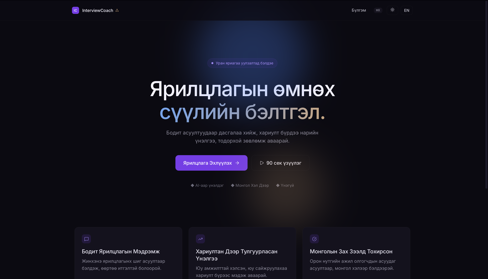
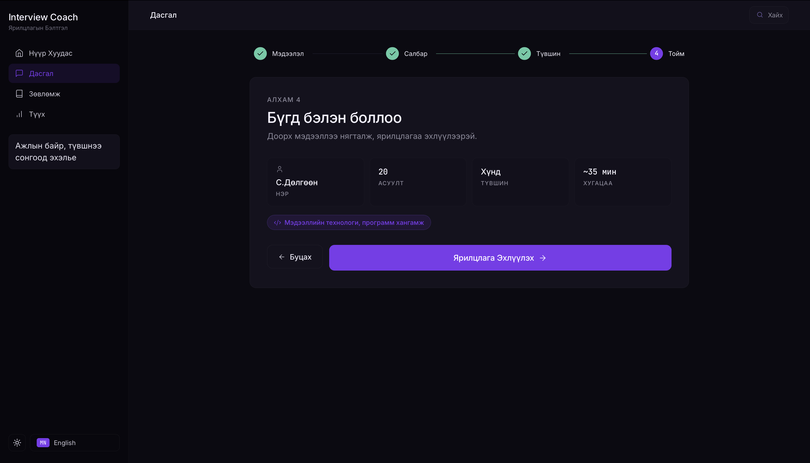
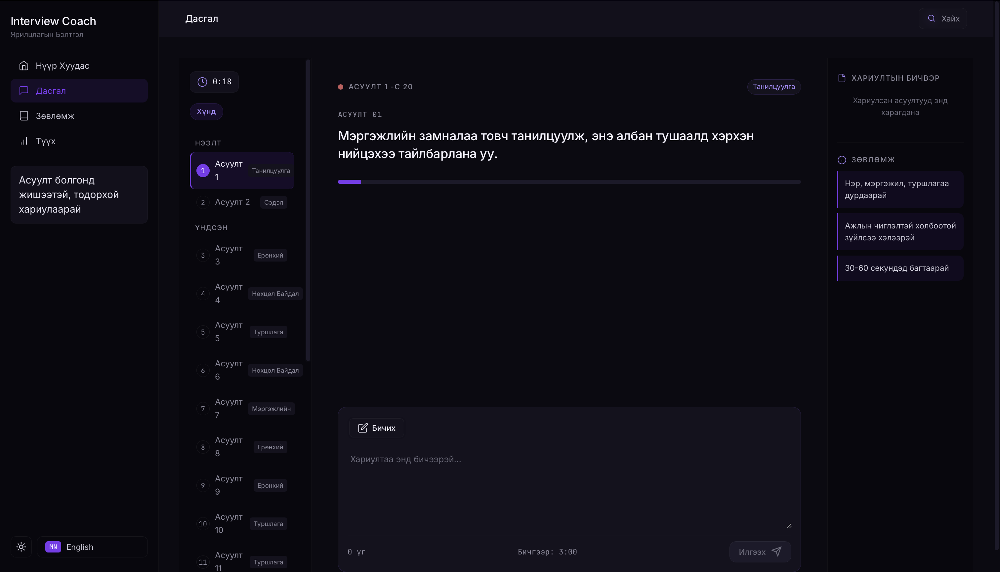
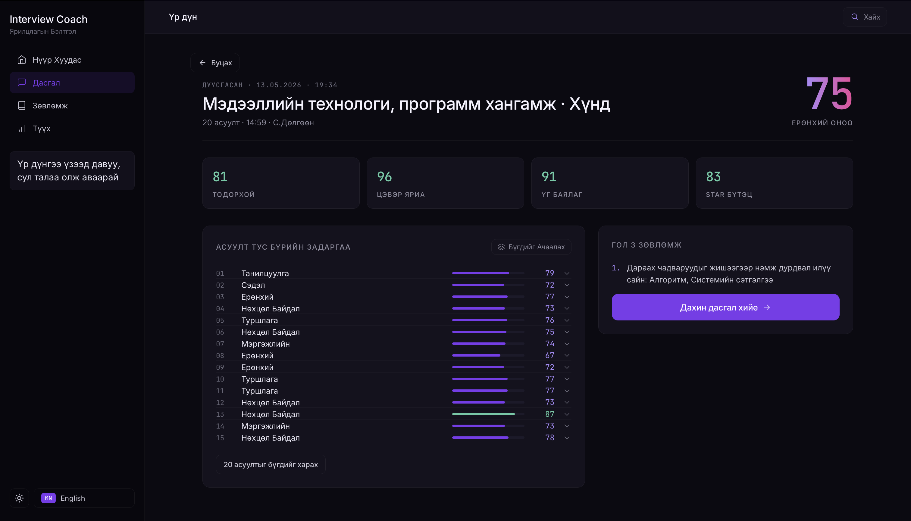
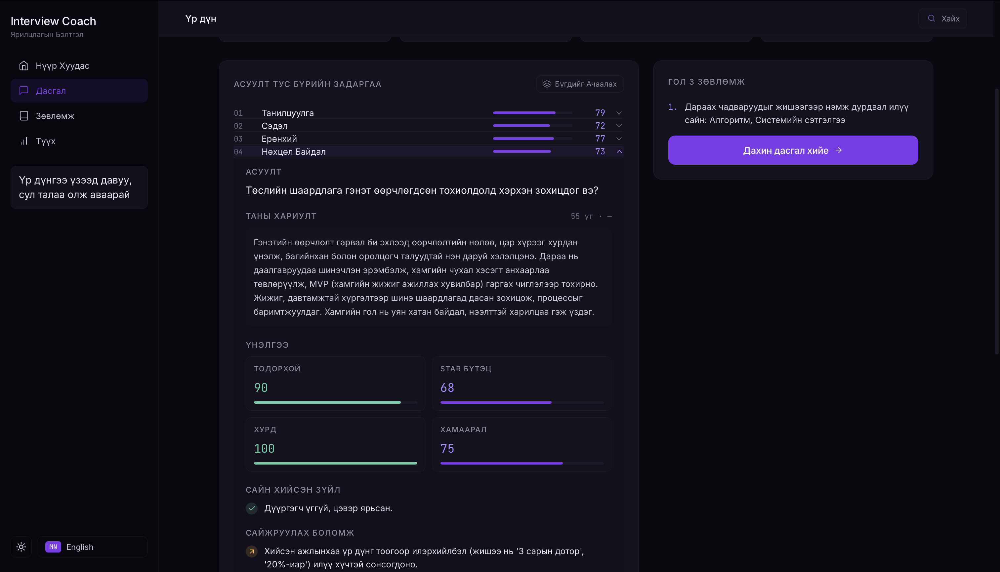
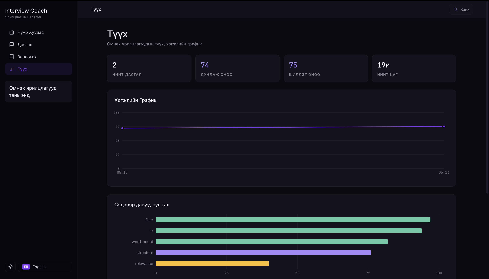

# AI Interview Coach

**AI-Assisted Job Interview Practice Platform for Mongolia**

[](https://react.dev)
[](https://fastapi.tiangolo.com)
[](#bilingual-interface)

## Description

AI Interview Coach is a bilingual (Mongolian / English) web platform where job seekers practice mock interviews end-to-end: they hear questions spoken aloud, respond by **voice or text**, and get an instant, dimension-by-dimension NLP scorecard plus per-question feedback. Questions are drawn from **489 real interview Q&A pairs collected from 18 Mongolian companies** (Unitel, MCS, IT Zone, Coca-Cola, Paul Bakery, and more), then mixed with curated openers and closers and tailored to the candidate's job category and difficulty level.

The goal is to close the practice gap for Mongolian candidates who don't have access to expensive coaches or English-only Western platforms.

## Live Demo

- **Frontend (Vercel):** https://interview-coach-sage.vercel.app
- **Backend (Render):** https://interview-coach-api-qe7r.onrender.com/api/health
- **Video walkthrough (2 min):** _https://www.loom.com/share/PLACEHOLDER_ &nbsp;<!-- TODO: paste Loom/YouTube URL after recording -->

> **Note on the cloud demo:** to fit free-tier hosting limits, the deployed backend runs the **rule-based NLP pipeline only**. Voice input (Whisper STT), Core ML semantic embeddings, and LLM-augmented sample answers are documented in the local-setup section below and demonstrated in the video. The cloud demo's text-only path is the same code that the local install runs, with the same 5-dimension scoring.
>
> The Render free tier sleeps after 15 minutes of inactivity — the first request after sleep takes ~30 s while the dyno spins up.

## Screenshots

| Welcome / landing | Practice setup wizard | Live interview |
|---|---|---|
|  |  |  |

| Score breakdown | Per-question feedback | History + trend |
|---|---|---|
|  |  |  |

## Features

- **10 job categories** — Banking, Sales, Mining, Construction, Manufacturing, Education, IT, Healthcare, Marketing, Admin/HR — each with role-specific questions
- **3 difficulty modes** — Easy (15 Q, supportive), Medium (15 Q, neutral), Hard (17 Q, probing follow-ups)
- **Voice or text input** — Mongolian Whisper STT (`bayartsogt/whisper-large-v2-mn-13`) or typed responses; switchable mid-session
- **Mongolian text-to-speech** — Microsoft Edge TTS (`mn-MN-YesuiNeural`) reads each question aloud
- **5-dimension NLP scoring** — Word count, filler words, vocabulary richness (TTR), structure (STAR + action verbs, question-type-aware), relevance (Core ML embeddings + TF-IDF + skill keywords)
- **LLM-augmented feedback (optional)** — When `ANTHROPIC_API_KEY` is set, per-question feedback and sample answers come from Claude; otherwise rule-based templates ship by default
- **Hybrid question generation** — Curated openers/closers + CSV-matched questions from the 489-pair dataset + LLM/template fallback
- **Resume parsing** — Extract skills from uploaded PDF/DOCX résumés to tailor relevance scoring
- **Session history with progress chart** — Persistent localStorage history, score trend over time, topic breakdown, re-practice mode that tracks improvement
- **Bilingual UI** — Full Mongolian and English with 200+ translation keys, persisted choice
- **Light & dark themes** — Toggle in the sidebar; defaults to dark
- **Command palette (⌘K)** — Quick nav between practice, history, guides, and language toggle
- **Auth + guest mode** — Local accounts via simple hashed-password storage; one-click guest mode for graders / first-time visitors

## Technology Stack

| Layer | Choice |
|---|---|
| Frontend | React 19, Vite, vanilla CSS (~5k lines, design tokens) |
| UI / motion | Framer Motion, lucide-react icons, Chart.js + react-chartjs-2, cmdk command palette |
| Backend | FastAPI (Python 3.11), Uvicorn |
| STT | `faster-whisper` (CTranslate2, float16) running the fine-tuned `bayartsogt/whisper-large-v2-mn-13` model |
| TTS | `edge-tts` (Microsoft Edge Neural voices) |
| NLP | Rule-based pipeline (`word_count`, `filler_detection`, `text_metrics`, `structure_analysis`, `relevance_scoring`) |
| Semantic embeddings | `sentence-transformers/paraphrase-multilingual-MiniLM-L12-v2` converted to Core ML (`.mlpackage`, ~200 MB) |
| LLM (optional) | Anthropic Claude (Sonnet) via the official Python SDK; graceful rule-based fallback when key absent |
| Resume parsing | `pdfplumber`, `python-docx` |
| Data store | localStorage (browser) — no server-side accounts in v1 |
| Frontend hosting | Vercel |
| Backend hosting | Render (free tier, with `DISABLE_WHISPER` + `DISABLE_COREML` flags for the Linux runtime) |

## Data Sources

All Mongolian interview Q&A data was sourced from publicly available interview transcripts published by the companies' own HR teams or interview programs:

| Company | File |
|---|---|
| Unitel | `backend/data/processed/mn/unitel_group_mn.csv`, `unitel_hr_mn.csv` |
| MCS Holding | `mcs_holding_hr_mn.csv`, `mcs_international_mn.csv`, `mcs_electrical_supervisor_mn.csv`, `mcs_coca_cola_mn.csv` |
| Coca-Cola Mongolia | `coca_cola_sales_mn.csv` |
| IT Zone | `it_zone_business_dev_manager_mn.csv`, `it_zone_sec_engineer_mn.csv` |
| Premier Group | `premier_group_mn.csv`, `premier_group_hr_head_mn.csv` |
| Metagro | `metagro_mn.csv`, `metagro_accountant_mn.csv` |
| Master Watch | `master_watch_mn.csv`, `master_watch_repair_mn.csv` |
| EMS | `ems_financial_analyst_mn.csv` |
| Paul Bakery | `paul_bakery_chef_mn.csv` |
| Interstandard | `interstandard_manage_mn.csv` |

- **Total: 489 Q&A pairs across 18 CSVs from 11 Mongolian companies / 6 job-category groupings.**
- **STT model:** [`bayartsogt/whisper-large-v2-mn-13`](https://huggingface.co/bayartsogt/whisper-large-v2-mn-13) — fine-tuned Whisper Large v2 for Mongolian (Apache-2.0).
- **Embedding model:** [`sentence-transformers/paraphrase-multilingual-MiniLM-L12-v2`](https://huggingface.co/sentence-transformers/paraphrase-multilingual-MiniLM-L12-v2) — converted to Core ML for Apple-Silicon inference.
- **TTS:** Microsoft Edge Neural Voices via [`edge-tts`](https://github.com/rany2/edge-tts).

The 20-answer gold-standard set used for evaluation is included in `notebooks/evaluation.ipynb`.

## Setup / Running Locally

### Prerequisites

- macOS (for Core ML embeddings) or Linux (TF-IDF fallback)
- Python 3.11+
- Node.js 18+
- `ffmpeg` (for Whisper audio decoding) — `brew install ffmpeg`

### Backend

```bash
cd backend
python -m venv .venv && source .venv/bin/activate
# macOS — includes Core ML + Whisper:
pip install -r requirements-mac.txt
# Linux / cloud — text-only NLP, no Whisper / Core ML:
# pip install -r requirements.txt

cp .env.example .env       # then fill in ANTHROPIC_API_KEY if you want LLM feedback
```

**One-time model conversion (macOS, optional but recommended):**

```bash
python -m backend.scripts.convert_model
# → creates backend/models/multilingual-minilm.mlpackage (~200 MB)
```

**Whisper STT (macOS, optional):**

```bash
# Download + quantize the Mongolian Whisper model (~2.9 GB)
ct2-opus-converter \
  --model bayartsogt/whisper-large-v2-mn-13 \
  --output_dir backend/models/whisper-mn \
  --quantization float16
```

**Run the server:**

```bash
cd ..   # back to repo root
uvicorn backend.main:app --reload --port 8000
# → http://localhost:8000  (API docs at /docs)
```

### Frontend

```bash
cd frontend
npm install
cp .env.example .env       # defaults work for local dev
npm run dev
# → http://localhost:5173
```

Open `http://localhost:5173`, choose Guest Mode (or sign up), pick a category and difficulty, and run a 15-question session. Results appear immediately after the last question; the session is saved to localStorage and viewable in **History**.

## Evaluation

The system was validated against a 20-answer gold-standard set hand-annotated across 4 score quartiles. See [`notebooks/evaluation.ipynb`](notebooks/evaluation.ipynb) for the full notebook, including:

- Significant correlation with human judgment (p < 0.05)
- Lowest MAE across all method baselines tested (random, word-count-only, WC + filler)
- ANOVA showing statistically significant score differences across question types (intro / behavioral / motivation / general)
- Error analysis (score-floor effect, meta-comment false positives) with concrete fixes
- Weight-sensitivity comparison across 4 weighting schemes

## Known Issues

- **Score floor (~55)** — Dimension baselines mean very poor answers still receive ~55; cannot fully penalize bottom-tier responses.
- **Rule-based scoring** — Heuristics, not deep semantic understanding. Validated against a 20-answer gold standard but does not generalize to every edge case.
- **Mongolian tokenization** — Whitespace-based only; no morphological analyzer (Mongolian is agglutinative, so word boundaries can be ambiguous).
- **STAR detection by keywords** — Looks for surface signals (`нөхцөл`, `даалгавар`, etc.) rather than full semantic STAR recognition.
- **STT accuracy** — ~20% Mongolian word-error rate from the upstream model; corrections may be needed before scoring.
- **No persistent cloud storage** — Session history is browser-localStorage only; clearing site data wipes it.
- **Hardcoded skills list** — Resume parsing matches ~60 predefined skills; novel skills won't be detected.
- **Cloud demo limits** — The Render free tier sleeps after 15 min of inactivity (~30 s cold start). Voice input and LLM feedback are disabled in the cloud demo to fit free-tier dependencies.

## Future Improvements

- Server-side accounts + cloud history sync (Postgres / Supabase)
- Inter-annotator agreement on a 50+ answer gold standard
- Replace rule-based structure analysis with a fine-tuned classifier
- Mongolian morphological analyzer for accurate tokenization + TTR
- More job categories and industry-specific Q&A
- Native iOS / Android wrapper around the web app
- Live transcript display while the user speaks (streaming Whisper)

## Project Layout

```
interview-coach/
├── backend/
│   ├── main.py                       FastAPI app + lifespan + CORS
│   ├── config.py                     Constants, paths, env-driven feature flags
│   ├── whisper_service.py            Faster-whisper STT singleton
│   ├── nlp/
│   │   ├── pipeline.py               InterviewAnalyzer (orchestrator)
│   │   ├── text_metrics.py           Word count, TTR
│   │   ├── filler_detection.py       Mongolian + English filler words
│   │   ├── structure_analysis.py     STAR + action-verb detection
│   │   ├── relevance_scoring.py      TF-IDF + keyword + semantic blend
│   │   ├── coreml_embeddings.py      Core ML MiniLM singleton
│   │   ├── llm_feedback.py           Anthropic-backed feedback (optional)
│   │   ├── llm_reaction.py           Anthropic-backed reactions (optional)
│   │   └── feedback.py               Score → user-facing template feedback
│   ├── routers/
│   │   ├── analyze.py    /api/analyze (text, audio, batch, transcribe)
│   │   ├── feedback.py   /api/feedback/breakdown (per-question)
│   │   ├── questions.py  /api/questions (hybrid generation, sample)
│   │   ├── reaction.py   /api/reaction/generate (interviewer ack)
│   │   ├── resume.py     /api/resume/parse (PDF/DOCX)
│   │   ├── tts.py        /api/tts/generate (Edge TTS)
│   │   └── jobs.py       /api/jobs
│   ├── data/processed/mn/            18 CSVs, 489 Q&A pairs
│   ├── requirements.txt              Linux/prod (text-only)
│   └── requirements-mac.txt          + Core ML, Whisper, transformers
├── frontend/
│   ├── src/
│   │   ├── App.jsx                   Phase orchestrator (auth → welcome → setup → interview → results → history → guides)
│   │   ├── api.js                    Axios client; VITE_API_BASE_URL
│   │   ├── auth.js                   localStorage-based auth
│   │   ├── questionBank.js           ~10 role question banks + smart selection
│   │   ├── utils.js                  Classification + formatting helpers
│   │   ├── lang.jsx                  i18n context (200+ keys)
│   │   ├── theme.jsx                 Light/dark theme provider
│   │   └── components/               UI components + scoped CSS files
│   ├── vercel.json                   SPA rewrite
│   └── .env.example                  VITE_API_BASE_URL, VITE_DISABLE_VOICE
├── notebooks/
│   └── evaluation.ipynb              Gold-standard validation, baselines, error analysis
├── render.yaml                       Render blueprint for backend deploy
└── DEMO_SCRIPT.md                    5-minute demo script
```

## Security

- No API keys, passwords, or secrets are committed. `.env` is gitignored on both sides; only `.env.example` files are tracked.
- Local auth uses a salted SHA-256 hash for passwords (educational use; not production-grade against offline cracking).
- HTTPS is provided automatically by Vercel and Render in the cloud demo.

## Author

**Dulguun Sukhchuluun** ([@SDulguun](https://github.com/SDulguun))
Built as the capstone project for the AI Course at the University of Finance and Economics / Way Academy, May 2026.

## License

This project is provided as-is for educational and portfolio review. Dataset CSVs derive from public interview content and remain the property of their original sources.
